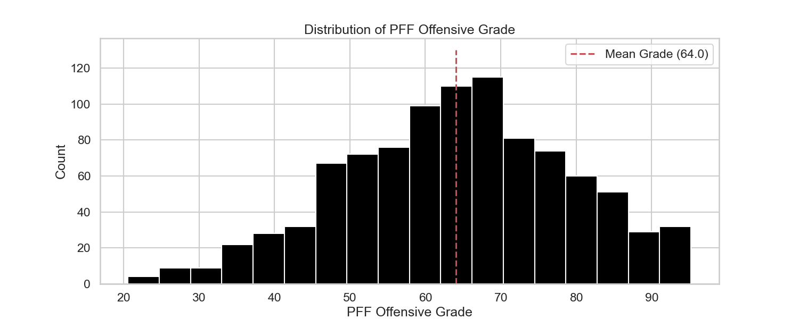

Welcome to __Pass Forward__, where we aim to anticipate quarterback performance!

# Business Problem
In the NFL, the most important position on the field is the quarterback position. Accurately predicting QB performance can give NFL organizations insight on how to assess their own QB, as well as assessing other QBs around the league (say for potential trading opportunities). These predictions also have obvious applications in the realm of sports betting and fantasy football.

How do we measure QB performance? Passing statistics, like yards, touchdowns, or completion percentage are often not indicative of a player's performance. Rating systems like NFL passer rating or ESPN's QBR also have their weaknesses, and can be heavily influenced by other players on the field (namely the offensive line or wide receiver corps).

The metric used to measure performance was Pro Football Focus' __Offensive Grade__. PFF is an analytics organization that works with all 32 NFL teams to provide data-driven insights. Their database contains a trove of advanced statistics and measurements used to capture a player's complete performance. "Grade" was chosen as the target, as it rewards players for their true performance, regardless of the play's outcome. It is widely considered the best metric to assess player performance in the NFL. 

With that, the goal of this project was to predict 2023 QB offensive grade with maximum accuracy.

# Data
The data used in this project was completely sourced from [pff.com](pff.com). The dataset contained over 1300 QB seasons of 288 unique NFL QBs, extracted from the 2006-2023 NFL seasons. Postseason data was exluded, as it introduces inconsistency in the volume for each player. This included backup QBs who only played a single game during the season, to QBs who played all 16 or 17 games during the year. The data contained 61 numerical passing and rushing statistics that were used to train the predictive models. 

The data was formatted in such that a single row represented a single season from a specific QB. For example, Patrick Mahomes had 7 rows in the dataset, as he has played in 7 different seasons.

# Analysis
Here is the distribution of the target variable:

The average offensive grade in the dataset was 64, with a standard deviation of about 15.

# Models
I tested 11 total machine learning algorithms. First, I simply looked at models that took the previous season of quarterback to predict their performance in the next. I also looked at sequence models (RNN, LSTM, GRU), where the input was a sequence of quarterback seasons. I had high hopes for these models, but unfortunately, they performed very poorly, likely due to the small size of the data set. The best performing algorithm ended up being ____.

Final two models: 
- The __Backup Benchmarker__ - a ____ trained only on seasons where less than 9 games were played.
- The __Primary Passer Predictor__ - a ____ trained only on seasons where at least 9 games were played.

# 2023 Predictions
since 10 out of 18 of the 2023 NFL weeks have already been played, we can actually see how well our final predictions have done thus far through the season. Here is a dataframe holding the predictions for all 48 QBs who have played so far this season:

Using these first 10 weeks, our RMSE was ____ and R-Squared was ____.

__71%__

Here is a visualization of our final models predictions:

Each point represents a single player in 2023. The distance from the black line is how far off our prediction was. A perfect model would only have dots on the line. Dots above the line are cases in which our model overpredicted the player's performance, and dots below the line are under-predictions.

# Conclusion
